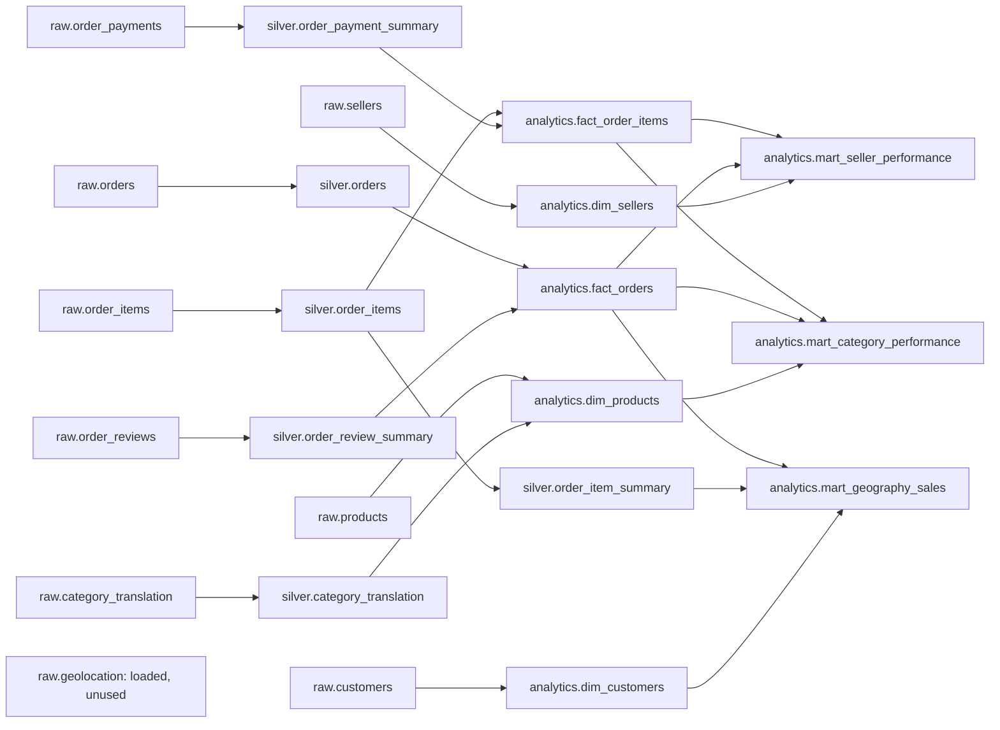

# Model lineage

The dbt project builds three layers of views. Raw CSVs are loaded by the Python
pipeline into the nine `raw` tables; dbt then builds six `silver` views and eight
`analytics` views on top of them. Sources, models, and tests are declared in
`dbt/models`.

## Layers

| Layer | Objects |
| --- | --- |
| `raw` | 9 source tables: orders, order_items, order_payments, order_reviews, customers, products, sellers, category_translation, geolocation |
| `silver` | 6 views: orders, order_items, order_item_summary, order_payment_summary, order_review_summary, category_translation |
| `analytics` | 3 dimensions (customers, products, sellers), 2 facts (orders, order_items), 3 marts (seller, category, geography) |

## Lineage



Reading the graph:

- `fact_orders` joins cleaned orders to per-order review summaries.
- `fact_order_items` joins cleaned items to per-order payment summaries.
- Seller/category marts read both facts and their dimensions; geography reads
  `fact_orders`, `dim_customers`, and `silver.order_item_summary` for full
  per-order price plus freight.
- `raw.geolocation` is loaded and validated but not referenced by any model.

## Interactive lineage

Generate and serve the dbt documentation to explore the model DAG and descriptions
in a browser. The default dbt v2 generation does not include column-level lineage:

```bash
uv run --locked python -m app.etl.transform docs generate
uv run --locked python -m app.etl.transform docs serve --port 8080
```

The generated `dbt/target/` artifacts are gitignored; regenerate them locally.
